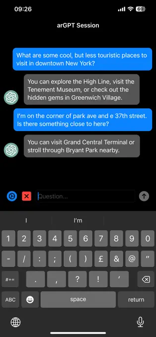

# arGPT for iOS: AI Chat for Monocle with iOS Devices
*Copyright 2023 Brilliant Labs Ltd.*

## Overview

*arGPT for iOS* is an application that pairs to your [Monocle](https://brilliant.xyz/products/monocle) and empowers you with access to ChatGPT anywhere you need it. Simply tap to speak a question and see the response appear in your field of view. The iOS application can also function as a standalone chat interface to ChatGPT, allowing queries to be entered via the iOS keyboard.

## Getting Started

Getting started is easy:

- [Install the iOS app](https://apps.apple.com/us/app/argpt/id6450499355).
- [Obtain an OpenAI API key](https://platform.openai.com/). Obtaining a new API key is straightforward from the account management page, shown below. If you have not already done so, you will need to register an OpenAI account and set up billing. For peace of mind, we recommend new users set very low usage limits (under *Billing* and *Usage Limits*). For example, a soft limit of $5 and a hard limit of $10 will be more than sufficient for casual users and is highly unlikely to be reached in a single month.

- Open the app and power up Monocle!

## For Developers

We encourage developers to extent *arGPT for iOS* or to use it as a template project for their own Monocle apps. This section provides a brief overview of the program structure.

### Key iOS App Source Files

The iOS project is located in `ios/arGPT/`. Open `ios/arGPT/arGPT.xcodeproj` using Xcode. All source files and assets are in `ios/arGPT/arGPT/`. The key files to start with are:

- `ARGPTApp.swift`: *arGPT for iOS* is a SwiftUI app and this is the main module. It defines the top-level SwiftUI view and instantiates a very important object of class `Controller` that handles program logic, including communication with Monocle.
- `Controller.swift`: The main program controller and the heart of the app. Performs the following:
    - Subcribes to `pairedDeviceID` setting: This determines which Monocle device we are "paired" to. Bluetooth bonding is not performed. Rather, the iOS app stores a device ID that it uses to connect to Monocle each time. When this is changed, either in the app's iOS settings panel or in the app's settings screen, `Controller` notifies the Bluetooth manager. If the device ID has changed, the Bluetooth manager will disconnect from the current device and attempt to connect to the new one.
    - Subscribes to Bluetooth events on the `BluetoothManager` object:
        - `peripheralConnected`: Fires whenever a connection with a Monocle device is established. This kicks off a state machine that uploads Python scripts to Monocle and handles bi-directional communication between the iOS app and Monocle.
        - `peripheralDisconnected`: Indicates Monocle has disconnected.
        - `serialDataReceived`: Data has been received on the serial Tx characteristic. MicroPython on Monocle uses this as its standard output and the iOS app monitors it to ensure Monocle is in the intended state each step of the way.
        - `dataReceived`: Data has been received on the data Tx characteristic. This is used for app-specific messaging (commands from the Monocle scripts).
    - Accepts queries from both Monocle (as voice data) or the app's chat window (as text strings) to pass on to ChatGPT.
    - Transmits required Python scripts to Monocle using a simple state machine. Monocle is first placed into raw REPL mode.
    - Sends user queries to ChatGPT and then forwards the results to both the the iOS chat window and Monocle.
- `Bluetooth/BluetoothManager.swift`: The Bluetooth interface. Uses Apple's [CoreBluetooth framework](https://developer.apple.com/documentation/corebluetooth). Connects to Monocle devices, provides bi-directional communication via the serial and data characteristics, and forwards all events using [Combine](https://developer.apple.com/documentation/combine) publishers.
- `OpenAI/ChatGPT.swift`: Submits requests to ChatGPT maintaining a conversational history. When the history limit is exceeded, the history is automatically cleared. Attempts to perform background URL requests so that the app can function with the screen off.
- `OpenAI/Whisper.swift`: Submits audio to Whisper for transcription. Note that audio is first converted to M4A format by `Controller`.
- `Chat/`: This subdirectory contains all chat-related SwiftUI view and model objects.
- `Settings/`: Contains all settings-related SwiftUI view and model objects. The `Settings` class provides an interface for the app's settings, allowing e.g. the GPT model version to be changed. Changes to settings are published.

### Python Scripts

The Python code that runs on Monocle is stored in `ios/arGPT/arGPT/Script Assets/`. All files are uploaded to Monocle, which is then instructed to run `main.py`. Communication with the iOS app uses the data characteristic.

### iOS/Monocle Communication Flow

From the perspective of the iOS companion app, communication with Monocle is driven by a simple state machine:

- `disconnected`: Nothing to do. Waiting for connection to Monocle.
- `waitingForRawREPL`: On connect, iOS app transmits control codes over the serial characteristic that put Monocle in raw REPL mode. This state is then entered and monitors the serial characteristic for confirmation that this has succeeded. Once confirmed, the app asks Monocle to `print(ARGPT_VERSION)`. If `ARGPT_VERSION` is defined and matches the expected version string, the app enters the `running` state. Otherwise it loads the Python scripts and begins transmitting them one after another.
- `transmitingFiles`: This state monitors the serial characteristic to ensure the most recent file has been accepted before kicking off the next transfer. Once finished, the `running` state is entered.
- `running`: The app is running and responding to commands on the data characteristic.

The `running` state is where most of the work happens. Monocle communicates with the app using a simple protocol. All commands are handled in `onMonocleCommand` in `Controller.swift`. Although technically stateful, the protocol was designed so that the iOS app can simply react to each command. Each command is 4 characters followed by optional command-specific data:

- `ast:`: Audio start. Monocle will send over a new audio stream. The current buffered audio should be deleted.
- `dat:` Audio data. Audio data is sent across sequentially, one MTU-sized chunk at a time and is stored in a buffer.
- `aen:` Audio end. Monocle has finished transmitting audio. The iOS app can now transmit the audio to OpenAI for transcription. When transcription is finished, the result is stored in a map and assigned a unique transcription ID. The ChatGPT request is *not* kicked off automatically because multiple background mode URL requests are not permitted. Instead, the transcription ID is sent back to Monocle (`pin:` command, for "ping"), which will then send it right back ("pong") to kick off a new background request.
- `pon:` Transcription request pong. Monocle sends the transcription ID back to us, which would be completely redundant except for the fact that it should hopefully wake our app up a second time when in background mode allowing a new URL request to be sent to OpenAI for GPT. When this completes, the response message is sent using a `res:` command to Monocle, which displays the result.

### Python Script Versioning

A SHA-256 digest is computed from the Python scripts and their filenames by concatenating them all together. Then, just before transmitting them, the version string is inserted into the source code. Therefore, if *arGPT for iOS* is already running on Monocle, `ARGPT_VERSION` will have been defined and can be checked against the iOS app's Python scripts.

### Audio Format

As of the initial version, 8-bit 8KHz mono audio is sent from Monocle in order to minimize the transmission time. iOS `AVAudioPCMBuffer` does not support this format natively but the conversion to a 16-bit buffer is trivial.

Whisper expects 16-bit 16KHz audio. A drawback of the 8-bit sampling is loss of dynamic range and increased sensitivity to background noise.